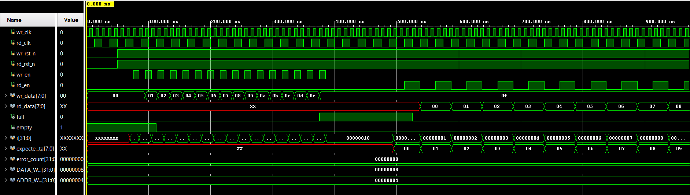
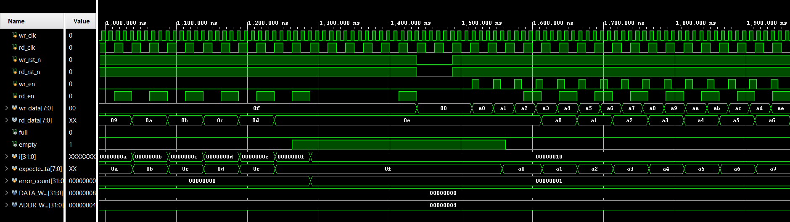
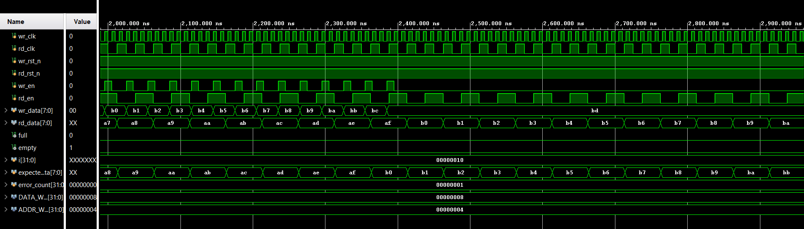

# Asynchronous FIFO (Verilog)

##  Project Overview
A fully parameterizable Asynchronous FIFO (First-In-First-Out) buffer designed using Verilog. This project addresses the classic digital design challenge of Clock Domain Crossing (CDC), allowing safe data transfer between two unrelated clock domains (e.g., a fast ADC writing data and a slow processor reading it).

##  Key Features
- Clock Domain Crossing (CDC) Uses 2-stage flip-flop synchronizers to mitigate metastability.
- Gray Code Pointers Implements Binary-to-Gray conversion for safe pointer passing across domains.
- Robust Flag Generation Generates Full and Empty flags with pessimistic timing to ensure no data loss (underflowoverflow protection).
- Parametric Design Width and Depth can be configured via Verilog parameters.

##  Architecture
The design consists of three core modules
1.  `fifo_mem.v` A dual-port RAM inference (True Dual Port) acting as the storage buffer.
2.  `synchronizer.v` A generic double-flop synchronizer to safely pass pointers between clock domains.
3.  `async_fifo.v` The top-level controller that handles Gray code conversion and flag logic.

##  Simulation & Verification
Verified using Xilinx Vivado. The testbench (`tb_async_fifo.v`) validates
- Corner Cases Full, Empty, Overflow, and Underflow conditions.
- Concurrent Access Simultaneous ReadWrite operations at different clock frequencies (100 MHz Write  40 MHz Read).
- Data Integrity Self-checking logic ensures `Data_Out` matches `Data_In`.

### Waveform Result




Waveform showing correct Full flag assertion and safe data retrieval during concurrent readwrite operations.

## 📂 File Structure
```text
rtl          - Source Verilog files (async_fifo, memory, synchronizer)
sim          - Simulation testbench

docs         - Waveform screenshots and diagrams
